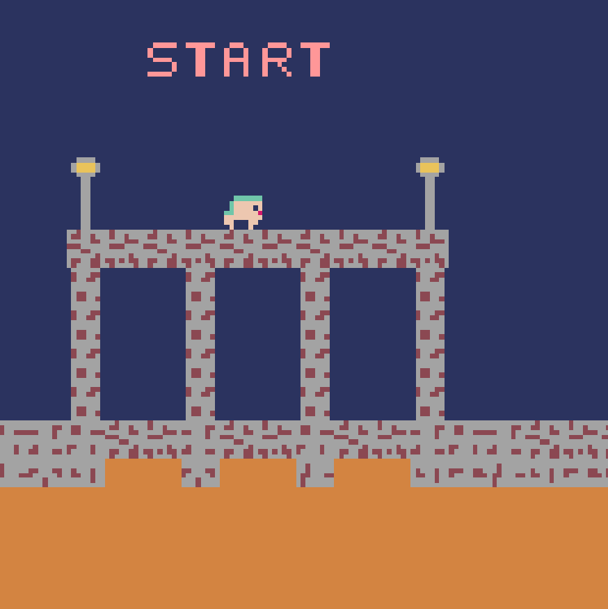
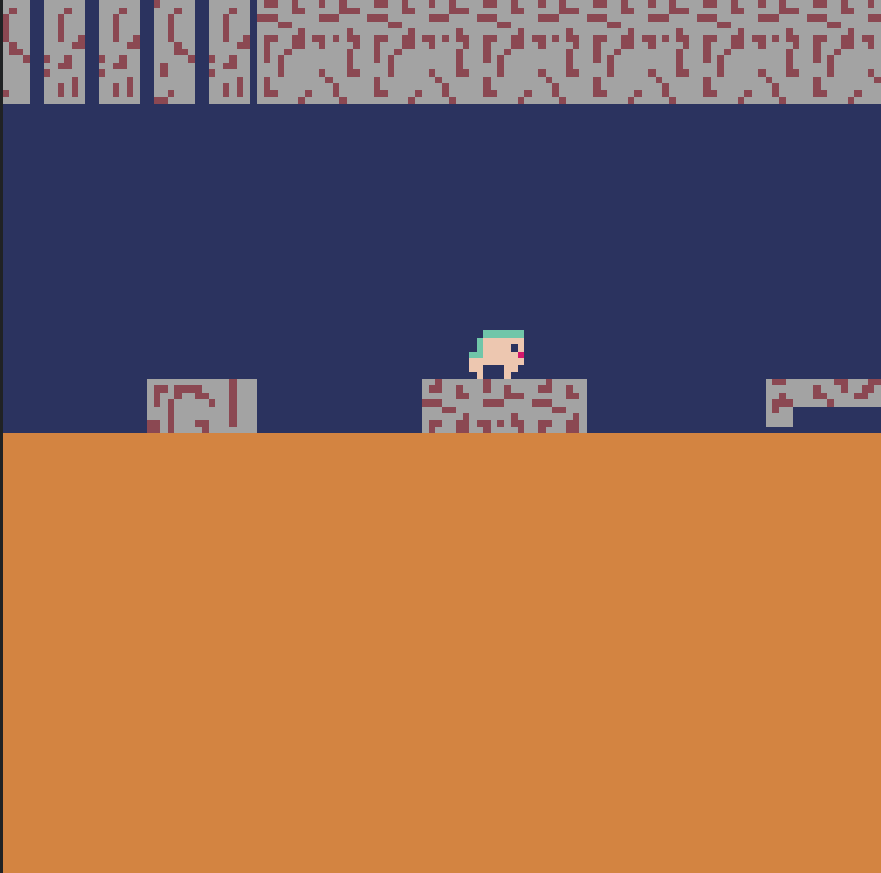

# ⚔️ Find Your Parents !

<p align="center">
  
  &nbsp;&nbsp;&nbsp;
  
</p>

> *Un deathrun fait en 8h — courez, sautez, survivez.*


---

## Préambule 

Le jeu qui a été réalisé en 8h est celui que vous pouvez retrouver dans la Release V1. Toutes les autres sont des ajouts pour une meilleure expérience ainsi qu'un effet compétitif.

---

## 🏰 Histoire

Dans un monde régi par l'Empire Byzantin, ta famille vit dans la misère la plus totale. Pour nourrir les leurs, tes parents ont tenté de voler dans les réserves du marché impérial.

**Ils se sont fait capturer.**

Ton devoir est clair : infiltrer les sous-sols du château et les ramener sains et saufs. Mais le château ne te facilitera pas la tâche…

---

## 🎮 Gameplay

**Find Your Parents!** est un **deathrun** en 2D : chaque seconde compte, chaque obstacle peut être fatal.

| Danger | Description |
|--------|-------------|
| 🧱 **Le mur** | Un mur avance depuis la gauche en permanence — il vous tue au contact. Ne ralentissez jamais. |
| 🔥 **La lave** | Toucher la lave = mort instantanée. |
| 🟡 **Les piques** | Des piques jaunes parsèment le sol et les plateformes. Précision requise. |

L'objectif : **atteindre la fin du niveau plus vite que tout ce qui veut vous tuer.**

Speedrun : **Vous vous sentez a l'aise ? Essayez de finir le niveau le plus vite possible et partagez ce score a vos amis afin qu'ils essayent de le battre !**

*Vous pensez avoir le meilleur temps jamais fait ? Ajoutez moi sur discord : cosmosdev03*

---

## ⌨️ Contrôles

| Touche | Action |
|--------|--------|
| `←` `→` | Se déplacer |
| `↑` | Sauter |

---

## 🚀 Installation

### Prérequis

- Python 3.x
- [Pyxel](https://github.com/kitao/pyxel)

### Lancer le jeu en le clonant

```bash
git clone https://github.com/Cosmos506/Pyxel-game.git
cd pyxel-game
pip install pyxel
python main.py
```

### Lancer le jeu dans sa version web

https://cosmos506.github.io/Pyxel-game/web/Pyxel-game.html

---

## 👥 Équipe

Projet réalisé en **8 heures** lors de plusieurs sessions à deux. 

| Rôle | Contribution |
|------|-------------|
| 💻 **Code** | Logique du jeu, moteur de déplacement, gestion des collisions (By CosmosDev)|
| 🎨 **Graphisme** | Sprites, tileset, animations pixel art (By Nathan D)|

---

## 🛠️ Fait avec

- [Python](https://www.python.org/)
- [Pyxel](https://github.com/kitao/pyxel) — moteur de jeu retro en Python

---
*Talk is cheap, show me your code.*
